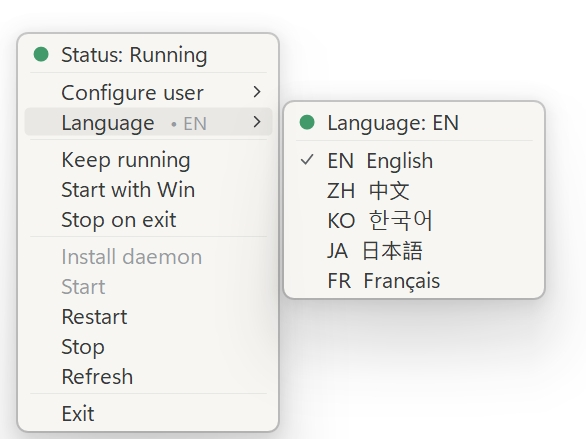

# CC-Tray ✨

🌍 [中文](README.zh-CN.md) | English

<p align="center">
  
</p>

CC-Tray is a lightweight Windows tray app for controlling an already configured `cc-connect daemon` running inside WSL. It ships as a single native executable of about 260 KiB.

`cc-connect` itself lives in WSL: install it there, configure its platforms/providers there, and make sure its daemon commands work there. CC-Tray runs on Windows only and provides a small tray menu that calls WSL through `wsl.exe`.

It does not replace `cc-connect`, configure bot credentials, or run the daemon natively on Windows.

## 🚀 Quick Start

Download the latest `CC-Tray.exe` from [Releases](https://github.com/STAR-REIN/CC-Tray/releases/latest) and run it on Windows.

On first launch, open the tray menu, choose the WSL user configuration submenu, and select the WSL distribution/user where `cc-connect` is already installed and configured.

## 🖼️ Preview

<p align="center">
  
</p>

## ✨ Features

- Opens from the Windows tray with left or right click.
- Single native exe, about 260 KiB.
- Auto-detects WSL distributions and their default users.
- Shows daemon state with colored status dots.
- Installs, starts, restarts, stops, and refreshes `cc-connect daemon`.
- Optional keep-running mode restarts the daemon if it stops unexpectedly.
- Optional Windows startup registration.
- Optional stop-on-exit behavior.
- Language menu: EN, ZH, KO, JA, FR.

All optional behaviors are disabled by default. If no WSL user is configured, daemon controls are disabled.

## ✅ Requirements

- Windows 10/11.
- WSL with a Linux distribution installed.
- `cc-connect` installed and configured inside the selected WSL distribution.
- .NET Framework runtime for running the app, usually already included with Windows.
- .NET Framework C# compiler for building from source, usually already available on Windows.

Before using CC-Tray, confirm these commands work in the target WSL user:

```bash
cc-connect daemon status
cc-connect daemon start
cc-connect daemon stop
```

If the daemon has not been installed yet, CC-Tray can run the default install command:

```bash
cc-connect daemon install --work-dir "$HOME/.cc-connect"
```

Use WSL directly if you need a custom work directory or extra `cc-connect` setup.

## 🛠️ Run From Source

From Windows PowerShell:

```powershell
powershell.exe -NoProfile -ExecutionPolicy Bypass -File .\run_tray.ps1
```

Or double-click `run_tray.vbs` from Explorer. The launcher builds `dist-native\CC-Tray.exe` when needed, then starts it silently.

## 📦 Build

```powershell
powershell.exe -NoProfile -ExecutionPolicy Bypass -File .\build_exe.ps1
```

The output is:

```text
dist-native\CC-Tray.exe
```

`logo.png` is embedded for the tray icon. `logo.ico` is used as the executable icon.

## 🌍 WSL User Configuration

On first launch, CC-Tray starts unconfigured. Open the tray menu, choose the user configuration submenu, and select a detected WSL distribution/user pair.

The selected WSL distribution and user are saved under the current Windows user registry key:

```text
HKCU\Software\CC-Tray
```

Windows startup registration, when enabled, is stored in the current user's `Run` registry key and points to the current executable path.

You can override the `wsl.exe` path with:

```powershell
$env:CC_CONNECT_WSL_EXE = "C:\Windows\System32\wsl.exe"
```
