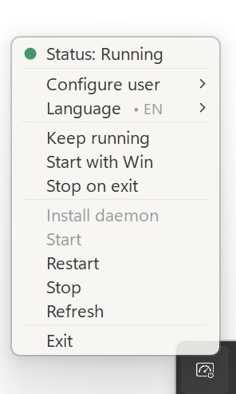

# CC-Tray

中文 | [English](README.md)

<p align="center">
  
</p>

CC-Tray 是一个运行在 Windows 上的轻量托盘应用，用来控制已经在 WSL 中配置好的 `cc-connect daemon`。

`cc-connect` 本体运行在 WSL 里：请先在 WSL 中安装它、配置好平台和凭据，并确认 daemon 命令可用。CC-Tray 只负责在 Windows 托盘里提供一个小菜单，通过 `wsl.exe` 调用 WSL 里的 `cc-connect daemon`。

它不会替代 `cc-connect`，不会配置机器人凭据，也不会在 Windows 原生环境里运行 daemon。

## 预览

<p align="center">
  
</p>

<p align="center">
  
</p>

## 功能

- 左键或右键点击 Windows 托盘图标打开菜单。
- 自动检测 WSL 发行版和默认用户。
- 用彩色状态点显示 daemon 状态。
- 支持安装、启动、重启、停止和刷新 `cc-connect daemon`。
- 可选“保持运行”，daemon 意外停止后会尝试重新启动。
- 可选“开机自启”。
- 可选“退出后停止服务”。
- 语言菜单：EN、ZH、KO、JA、FR。

所有可选功能默认关闭。未配置 WSL 用户时，daemon 控制项会禁用。

## 前置条件

- Windows 10/11。
- 已安装 WSL 和至少一个 Linux 发行版。
- 已在目标 WSL 发行版中安装并配置好 `cc-connect`。
- 运行程序需要 .NET Framework runtime。
- 从源码构建需要 .NET Framework C# 编译器。

使用 CC-Tray 前，请先确认这些命令在目标 WSL 用户下可用：

```bash
cc-connect daemon status
cc-connect daemon start
cc-connect daemon stop
```

如果 daemon 还没有安装，CC-Tray 可以执行默认安装命令：

```bash
cc-connect daemon install --work-dir "$HOME/.cc-connect"
```

如果你需要自定义 work dir 或额外配置，请先在 WSL 中手动完成。

## 从源码运行

在 Windows PowerShell 中运行：

```powershell
powershell.exe -NoProfile -ExecutionPolicy Bypass -File .\run_tray.ps1
```

也可以在资源管理器中双击 `run_tray.vbs`。启动器会在需要时构建 `dist-native\CC-Tray.exe`，然后静默启动。

## 构建

```powershell
powershell.exe -NoProfile -ExecutionPolicy Bypass -File .\build_exe.ps1
```

输出文件：

```text
dist-native\CC-Tray.exe
```

`logo.png` 会嵌入为托盘图标来源，`logo.ico` 用作 exe 文件图标。

## WSL 用户配置

首次启动时，CC-Tray 默认未配置用户。打开托盘菜单，进入用户配置子菜单，选择检测到的 WSL 发行版和用户即可。

选择结果会保存到当前 Windows 用户的注册表：

```text
HKCU\Software\CC-Tray
```

开启“开机自启”后，程序会把当前 exe 路径写入当前用户的 `Run` 注册表项。

你也可以用环境变量指定 `wsl.exe` 路径：

```powershell
$env:CC_CONNECT_WSL_EXE = "C:\Windows\System32\wsl.exe"
```

## 发布

构建产物已被 Git 忽略。发布 GitHub Release 时，请本地构建后上传 `dist-native\CC-Tray.exe`，不要把 exe 直接提交进仓库。
